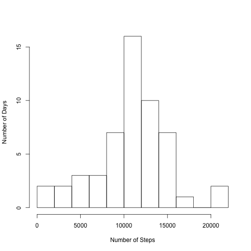
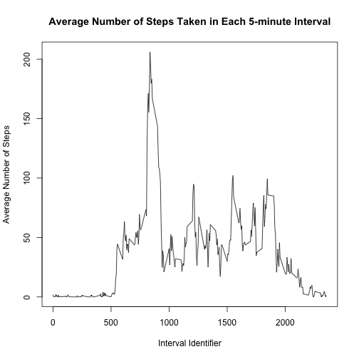
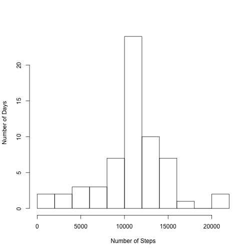
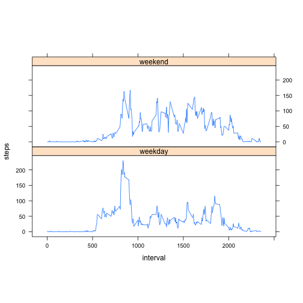

# Reproducible Research: Peer Assessment 1

## Loading and preprocessing the data

First, load the data into R. 
The zipped file `activity.zip` should be under the current working directory.  
Then, convert the column "date" to the date class.


```r
stepData <- read.csv(unzip("activity.zip"), header = T, as.is = T)
stepData$date <- as.Date(stepData$date, "%Y-%m-%d")
```

## What is mean total number of steps taken per day?

For this part, missing values in the dataset are ignored. 

1. Calculate the total number of steps taken per day.


```r
dailySteps <- sapply(split(stepData$steps, stepData$date), sum)
```

2. Plot a histogram of the total number of steps taken each day.


```r
hist(dailySteps, main = "", ylab = "Number of Days", xlab = "Number of Steps", breaks = 15)
```

 

3. Calculate the mean and median of the total number of steps taken per day.


```r
mean(dailySteps, na.rm = T); median(dailySteps, na.rm = T)
```

```
## [1] 10766.19
```

```
## [1] 10765
```

## What is the average daily activity pattern?

1. Make a time series plot of the 5-minute interval and the average number of steps taken, averaged across all days.


```r
avgIntervalSteps <- lapply(split(stepData$steps, stepData$interval), mean, na.rm = T)

plot(names(avgIntervalSteps), avgIntervalSteps, type = "l", main = "Average Number of Steps Taken in Each 5-minute Interval", xlab = "Interval Identifier", ylab = "Average Number of Steps")
```

 

2. Find the 5-minute interval that, on average across all the days in the dataset, contains the maximum number of steps.


```r
names(avgIntervalSteps)[which.max(avgIntervalSteps)]
```

```
## [1] "835"
```

## Imputing missing values

1. Calculate the total number of missing values in the dataset.


```r
sum(is.na(stepData$steps))
```

```
## [1] 2304
```

2. Fill in the missing values in the dataset with the mean for that 5-minute interval and create a new dataset with the missing values filled in using the aforementioned strategy.


```r
stepDataFilled <- stepData
missingIndex <- which(is.na(stepData$steps))

for (i in missingIndex) {
    intervalID <- as.character(stepData$interval[i])
    stepDataFilled$steps[i] <- avgIntervalSteps[[intervalID]]
}
```

3. Plot a histogram of the total number of steps taken each day.


```r
dailySteps2 <- sapply(split(stepDataFilled$steps, stepDataFilled$date), sum)

hist(dailySteps2, main = "", ylab = "Number of Days", xlab = "Number of Steps", breaks = 15)
```

 

4. Calculate the mean and median total number of steps taken per day.


```r
mean(dailySteps2); median(dailySteps2)
```

```
## [1] 10766.19
```

```
## [1] 10766.19
```

The impact of imputing missing data on the estimates of the total daily number of steps:

- The distribution does not change in shape, but it does coverge more to the middle after imputing missing data. A larger number of days fall into the bins near the mean.

- The mean total daily number of steps remains the same after imputing missing data.

- The median slightly increases from 10765 to 10766.19

## Are there differences in activity patterns between weekdays and weekends?

1. Create a new factor variable in the dataset with two levels – “weekday” and “weekend” indicating whether a given date is a weekday or weekend day.


```r
library(dplyr)
weekends <- c("Saturday", "Sunday")
stepDataFilled <- mutate(stepDataFilled, wday = factor(1 * (weekdays(date) %in% weekends), labels = c("weekday", "weekend")))
```
2. Make a panel plot containing a time series plot of the 5-minute interval and the average number of steps taken, averaged across all weekday days or weekend days.


```r
avgIntervalSteps2 <- aggregate(steps ~ interval + wday, stepDataFilled, mean)
library(lattice)
xyplot(steps ~ interval | wday, data = avgIntervalSteps2, aspect = 1/3, 
    type = "l")
```

 
